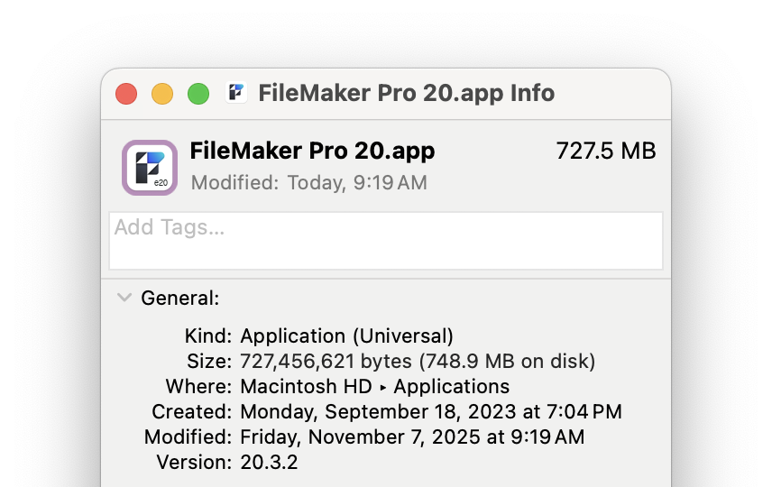

# FM Watermark Icon Generator

add a watermark to your FileMaker Pro icons to quickly differentiate filemaker versions. For example, you can add a "20" watermark to your FileMaker Pro 20 app and a "21" watermark to your FileMaker Pro 21 app.


## Installation

1. Download or clone this repository to your local machine.

   ```bash
   git clone https://github.com/jwillinghalpern/fm_watermark_icon.git
   cd fm_watermark_icon
   ```

2. Install [pillow](https://pypi.org/project/pillow/)

   ```bash
   python3 -m pip install --upgrade pip && python3 -m pip install pillow
   ```

3. Install [fileicon](https://github.com/mklement0/fileicon?tab=readme-ov-file#installation) using one of these approaches

   ```bash
   brew install fileicon
   ```

   or

   ```bash
   npm install fileicon -g
   ```

4. Make the script executable

   ```bash
   chmod +x fm_watermark_icon.py
   ```

5. (Optional but recommended) Move the script to a directory in your PATH for easy access

   ```bash
   cp fm_watermark_icon.py /usr/local/bin/fm_watermark_icon
   ```

## Usage Examples

### Watermark the icon of FileMaker Pro.app with "22" and immediately update the app icon automatically

If you added to your PATH:

```bash
fm_watermark_icon '/Applications/FileMaker Pro.app' 22
```

Alternatively call with python

```bash
python3 fm_watermark_icon.py '/Applications/FileMaker Pro.app' 22
```

### Watermark the icon of FileMaker Pro.app with "23" and save the new icon to a file without updating the app icon

```bash
fm_watermark_icon '/Applications/FileMaker Pro.app' 23 --output new_icon.icns
```

If you use this approach, you can manually update the app icon for FileMaker by right-clicking on the FileMaker Pro app in Finder and selecting "Get Info". Then drag or paste the new icon over the old one in the top left corner of the Info window.



## Notes

This only works on macos.
